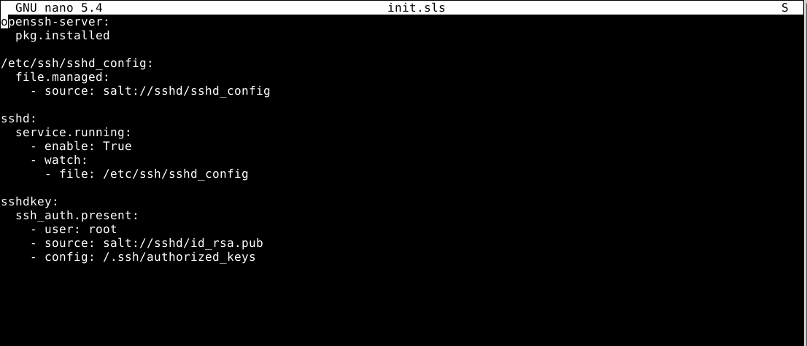

##Tests and some commands

These are my sls statefiles  

Statefile for Linux(tested on debian 11)

statefile for Windows(tested on Windows 10 Vm)

top.sls file to run one of the states based on os

state.apply results on debian and windows

I had OpenSSH service already installed on my Windows 10 VMs but if the OpenSSH service is not on the Windows machine already run the winsshd.sls anyway. It will install chocolatey and OpenSSH installation powershell script from chocolatey.  
after that run command:  
sudo salt 'MSEDGEWIN10' cmd.run 'C:\OpenSSH-Win64\install-sshd.ps1' shell=powershell

