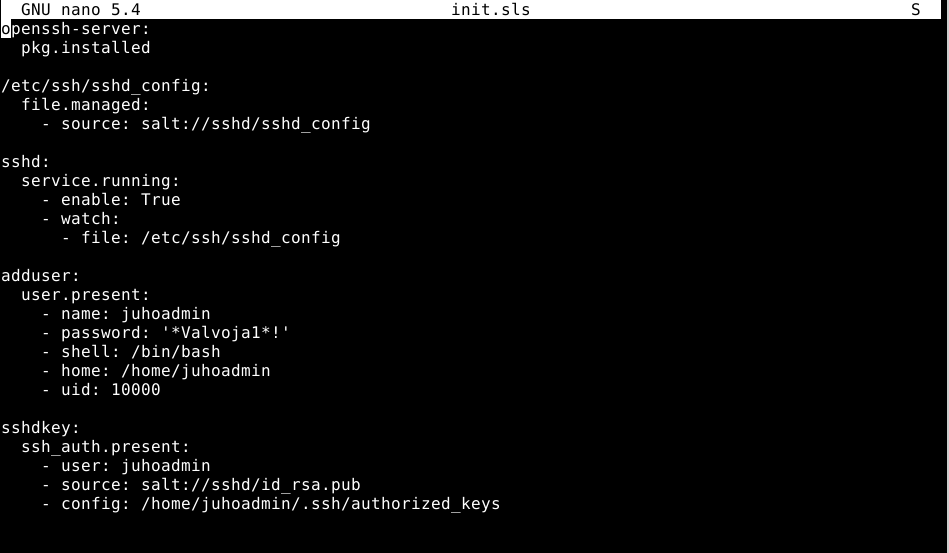
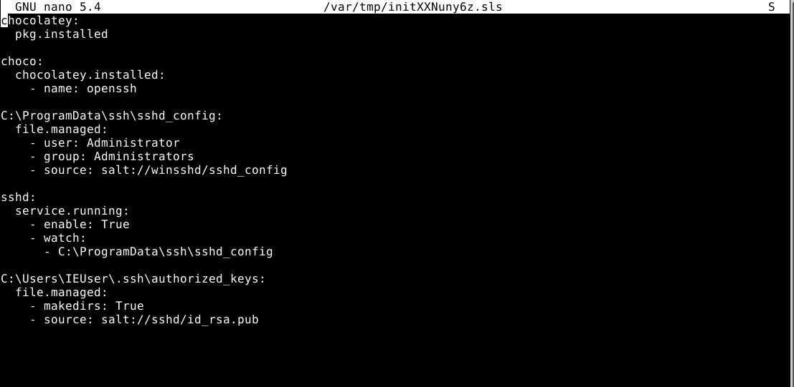
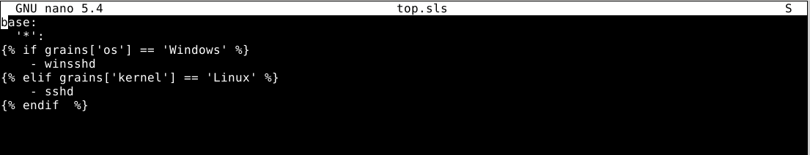
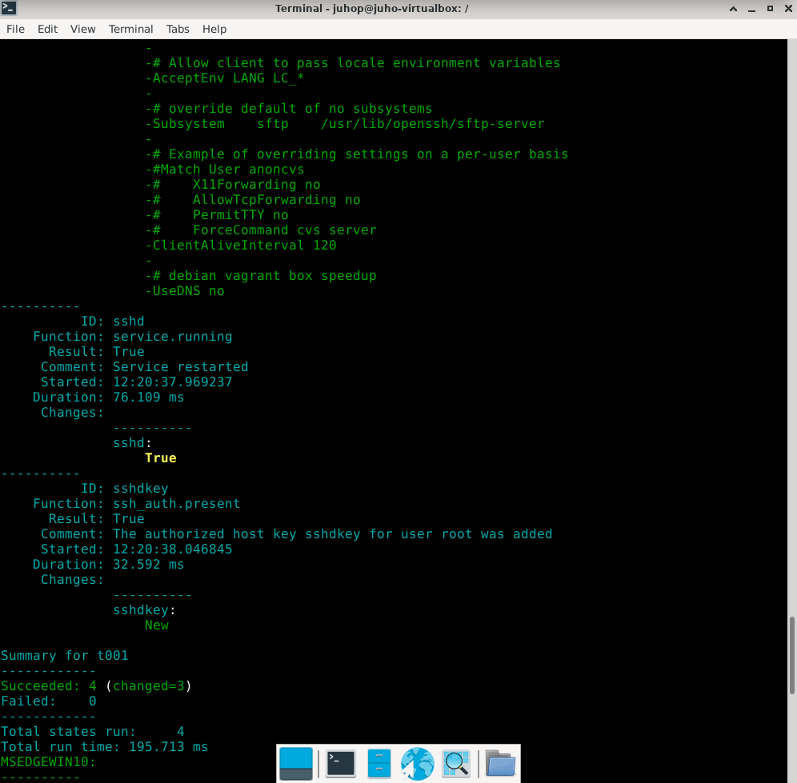
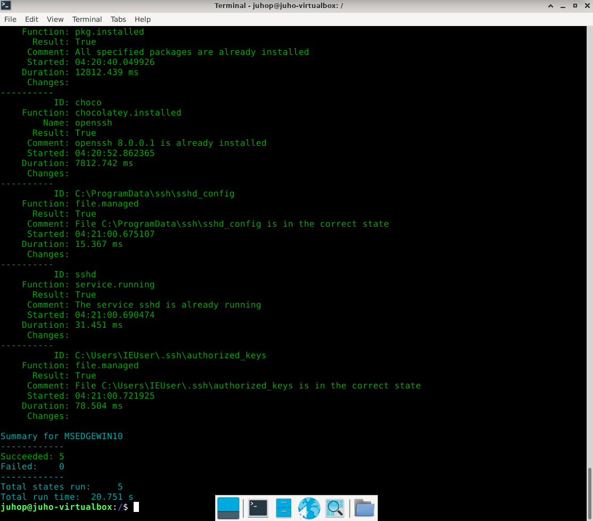
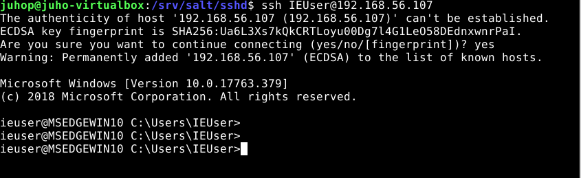

## Tests and some commands

# These are my sls statefiles  

# Statefile for Linux(tested on debian 11)

# statefile for Windows(tested on Windows 10 Vm)

# top.sls file to run one of the states based on os

# state.apply results on debian and windows

I had OpenSSH service already installed on my Windows 10 VMs but if the OpenSSH service is not on the Windows machine already run the winsshd.sls anyway. It will install chocolatey and OpenSSH installation powershell script from chocolatey.  
after that run command:  
sudo salt 'MSEDGEWIN10' cmd.run 'C:\OpenSSH-Win64\install-sshd.ps1' shell=powershell

If you install OPenSSH server from this powershell script you also need to add firewall rules. I dont yet know if there is a way to do this with salt command from master.  
I did this directly from the Windows minion powershell with this command:  
New-NetFirewallRule -Name sshd -DisplayName 'OpenSSH Server (sshd)' -Enabled True -Direction Inbound -Protocol TCP -Action Allow -LocalPort 22

Then we are ready to connect  

ssh IEUser@192.168.56.107  

# Sources

https://terokarvinen.com/2018/configure-windows-and-linux-with-salt-jinja-if-else-and-grains/
