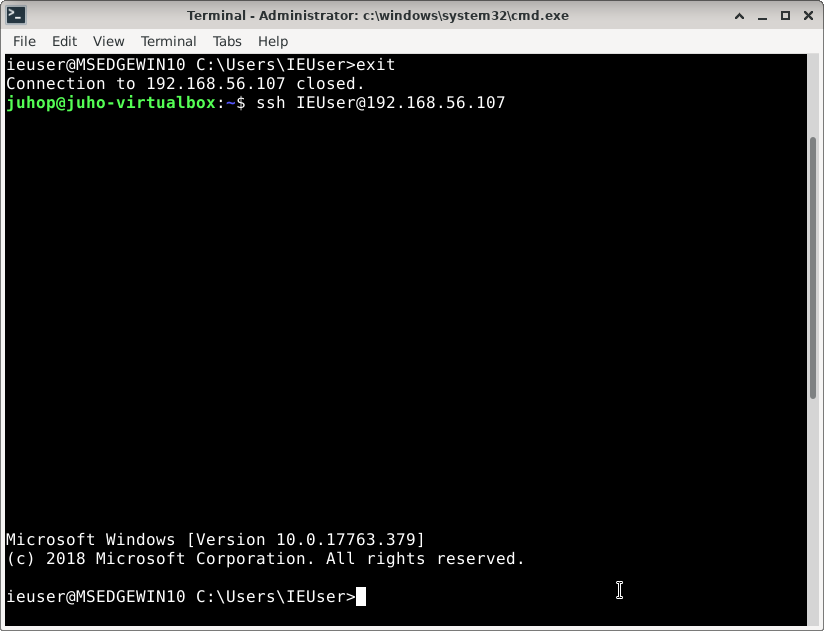

'# Palvelinten-hallinta-h7-miniprojekti

## Purpose and how to use
The purpose of this miniproject is to install OpenSSH, configure it and setup pubkeyauthentication from Salt-master to salt-minions with one state.apply  
Tested on Debian 11 Bullseye and Windows 10 VMs

You need a Linux salt-master and salt-minion/s.  
Clone the git repository to your master and apply top.sls to your minions.

Remember to replace filepaths with your own users and replace my publickey with your own or I will get access to your computers.

## This miniproject is part of Tero Karvinens course Palvelinten hallinta
course: [Palvelinten hallinta -ICT4TN022-3014 - 
2021](https://terokarvinen.com/2021/configuration-management-systems-palvelinten-hallinta-ict4tn022-2021-autumn/)

